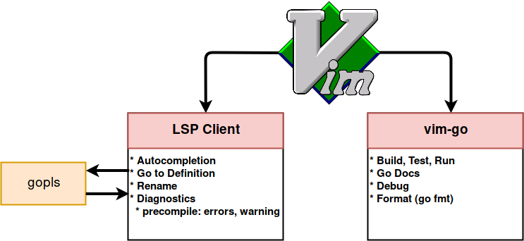

# [Neovim](https://github.com/neovim/neovim) 配置

Neovim 是一个 Vim 的一个分支，社区更活跃，相对于原生的 vim 速度更快，也有更多好用的特性：
- 支持 [LSP](https://microsoft.github.io/language-server-protocol/).
- 嵌入 [Lua5.1](https://jarmos.vercel.app/blog/vim-vs-neovim/lua.org), 用户可以根据 Lua 进行配置文件而不是 VimScript。
- 提供底层 [Neovim API](https://neovim.io/doc/user/api.html) 供开发者构建功能
- 有许多好用的内置标准库


## 插件管理
Neovim 社区拥有很多好用的插件可以帮助用户有更好的体验，这里介绍下自己用的插件。


### golang
在之前开发 golang 的时候一直用的是 goland，goland 确实很好用，可以支持 interface 之间的跳转、重命名的时候可以级别重命名所有的引用、debug 和跑单测的集成也不错。但是也有不少问题，太吃内存了，而且很贵！现在随着 vim 上 LSP 的插件不断完善，已经变得挺好用了，加上之前开发 c++ 的时候用过 vim ，所以在使用 vim 的时候略去了入门成本，所以决定切换到 Neovim.

go 官方的 LSP 工具是 [gopls](https://github.com/golang/tools/blob/master/gopls/README.md)

gopls 现在已经作为 vim-go 默认的工具，vim-go 使用 gopls 去执行各种任务，包括 build、run、doc 等，并且使用 LSP client 去进行代码的自动补全和跳转，下面是 vim-go 的基本工作流程。


lsp client 目前社区上比例流行的有两个 [Conquer of Completion(coc.vim)](https://github.com/neoclide/coc.nvim) 和 [LanuageClient-Neovim](https://github.com/autozimu/LanguageClient-neovim)，我目前用的是 coc，接下来是一些配置细节。

#### 准备
完成以下步骤：
- 安装 Neovim
- 安装 vim-plug (vim 插件管理工具)
- 安装 yarn (coc 需要)
- 设置好环境变量 **GOPATH** **GOROOT**
- 创建 ~/.config/nvim/init.vim (neovim 配置)

#### 安装 vim-go
1. 编辑 `init.vim`
```
vim ~/.config/nvim/init.vim
```
2. 把 vim-go 插件添加到插件管理列表
```
call plug#begin('~/.vim/plugged')

" < Other Plugins, if they exist >

Plug 'fatih/vim-go'
call plug#end()
```
3. 保存后在 nvim 里面执行 `:PlugInstall`
4. 安装 go 的相关工具，在 nvim 里面执行 `:GoInstallBinaries`

## 个人插件开发
### [nvim api](https://neovim.io/doc/user/api.html)

# 参考
- [golang ide](https://octetz.com/docs/2019/2019-04-24-vim-as-a-go-ide)
- [git 配置](https://jakobgm.com/posts/vim/git-integration/)

